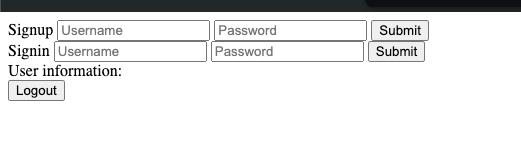

Can you try creating a middleware called auth that verifies if a user is logged in and ends the request early if the user isn’t logged in?


Until now, we’ve been using POSTMAN to send out all of our requests. 

Now, lets create a `full stack` application. Lets write the frontend that lets you

1. Signup
2. Signin
3. Get your information
4. Logout

### Writing the frontend

- Create a `public/index.html` file
    
    ```jsx
    mkdir public
    cd public 
    touch index.html
    ```
    
- Create a `signup section`
    
    ```jsx
    <div>
        Signup
        <input type="text" name="username" placeholder="Username">
        <input type="password" name="password" placeholder="Password">
        <button onclick="signup()">Submit</button>
    </div>
    ```
    
- Create a `signin section`
    
    ```jsx
    <div>
        Signin
        <input type="text" name="username" placeholder="Username">
        <input type="password" name="password" placeholder="Password">
        <button onclick="signin()">Submit</button>
    </div>
    ```
    
- Create a `User information` section
    
    ```jsx
    <div>
        User information: 
        <div id="information"></div>
    </div>
    ```
    
- Create a logout button
    
    ```jsx
    <div>
        <button onclick="logout()">Logout</button>
    </div>
    ```
    

### Writing the onclick handlers

- Add the axios external library
    
    ```jsx
    <script src="https://cdnjs.cloudflare.com/ajax/libs/axios/1.7.7/axios.min.js"></script>
    ```
    
- Write the signup function
    
    ```jsx
    async function signup() {
        const username = document.getElementById("signup-username").value;
        const password = document.getElementById("signup-password").value;
    
        const response = await axios.post("http://localhost:3000/signup", {
            username: username,
            password: password
        })
        alert("Signed up successfully");
    }
    ```
    
- Write the signin function
    
    ```jsx
    async function signin() {
        const username = document.getElementById("signin-username").value;
        const password = document.getElementById("signin-password").value;
    
        const response = await axios.post("http://localhost:3000/signin", {
            username: username,
            password: password
        });
    
        localStorage.setItem("token", response.data.token);
    
        alert("Signed in successfully");
    }
    ```
    
- Write the logout function
    
    ```jsx
    async function logout() {
        localStorage.removeItem("token");
    }
    ```
    
- Write the `getUserInformation` function
    
    ```jsx
    async function getUserInformation() {
        const token = localStorage.getItem("token");
    
        if (token) {
            const response = await axios.get("http://localhost:3000/me", {
                headers: {
                    Authorization: token
                }
            });
            document.getElementById("information").innerHTML = response.data.username;
        }
    }
    ```
    

### Updating the backend

Lets serve the `index.html` file directly from the backend

- Approach #1
    
    ```jsx
    app.get("/", function(req, res) {
        res.sendFile("./public/index.html")
    })
    ```
    
- Approach #2
    
    ```jsx
    app.use(express.static("./public"))
    ```
    

(attachment:d5363587-94b4-404e-b1a6-0649d256ca05:Screenshot_2024-09-08_at_7.44.28_PM.png)

## Firing the `getUserInformation` call

- Call the `getUserInformation` function when the page loads
    
    ```jsx
    getUserInformation();
    ```
    

### Assignment

Conditionally render the `logout` or the `signin`/ `signup` pages based on if the user is already logged in or not